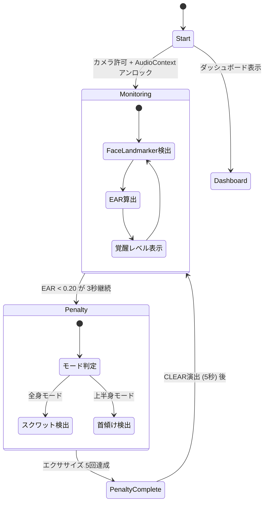
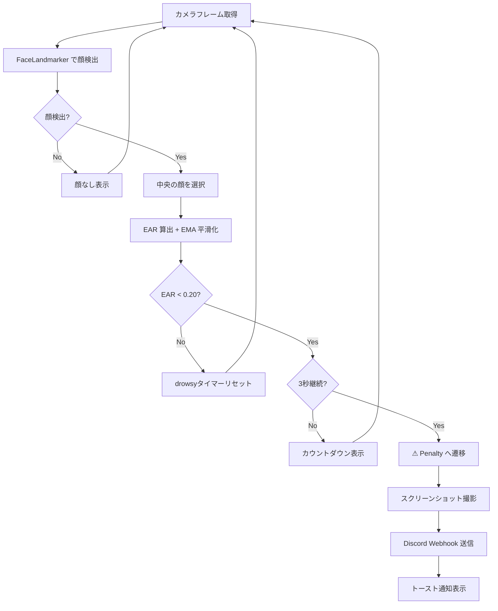
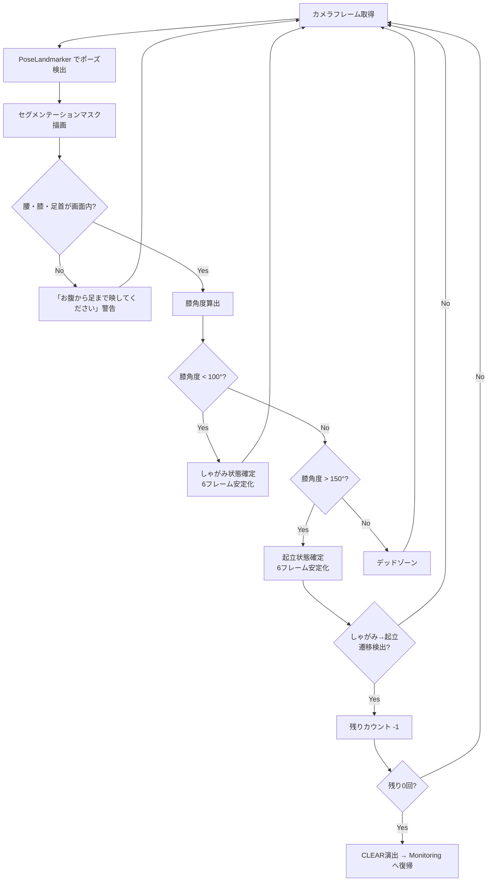
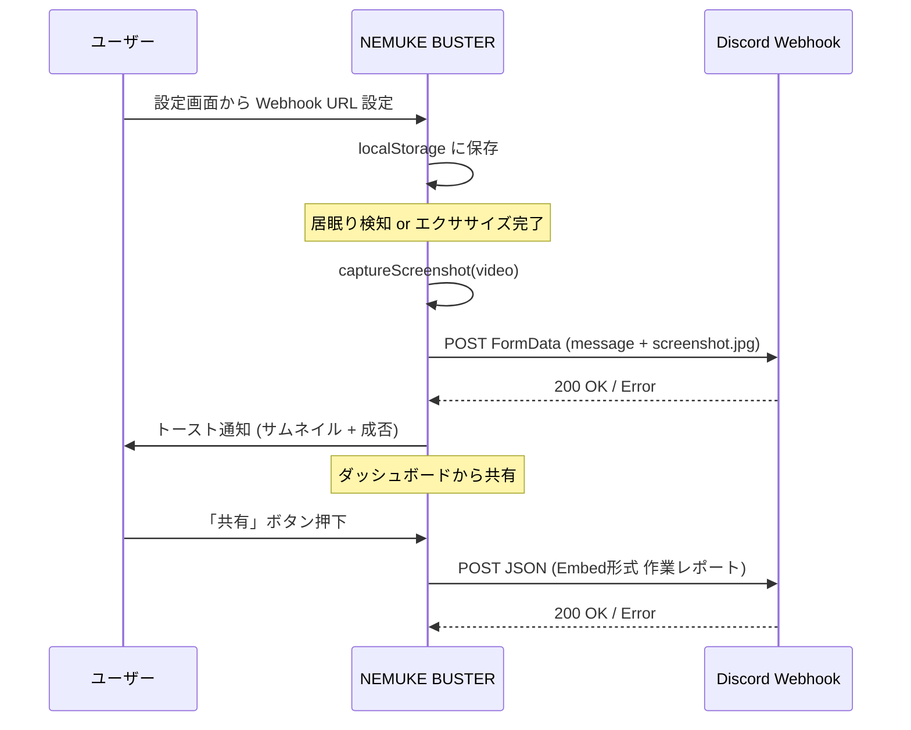

# NEMUKE BUSTER - 居眠り検知 & 運動強制解除 Web アプリ

サーバー不要、スマホのブラウザだけで完結する居眠り検知アプリ。
居眠りを検知するとアラームが鳴り、**スクワット 5 回**または**首ストレッチ 5 回**で解除できる。

## 技術スタック

| カテゴリ | 技術 |
|---------|------|
| フロントエンド | React 19 + TypeScript, Vite 7 |
| スタイリング | Tailwind CSS v4 (ダークテーマ + ネオンアクセント) |
| AI 推論 | @mediapipe/tasks-vision (ブラウザ上 WASM + GPU) |
| 顔検出 | FaceLandmarker — 478 点顔メッシュ, EAR 計算, 首傾け角度検出 |
| ポーズ検出 | PoseLandmarker Lite — 33 点骨格, 膝角度スクワット判定, セグメンテーションマスク |
| アラーム | Web Audio API — square 波 880Hz + 8Hz LFO 変調 |
| 通知 | Discord Webhook — スクリーンショット付き自動通知 + 作業レポート共有 |
| データ管理 | IndexedDB — セッション記録 + ダッシュボード集計 |
| アナリティクス | Vercel Analytics + Google Analytics (GA4) |
| HTTPS | @vitejs/plugin-basic-ssl (モバイルカメラ API 対応) |

## 主要機能

### 2つのエクササイズモード

| モード | 検出方法 | 必要な映り |
|--------|---------|-----------|
| 全身モード (スクワット) | PoseLandmarker — 膝角度判定 + セグメンテーション可視化 | お腹から足まで |
| 上半身モード (首ストレッチ) | FaceLandmarker — 頬端ランドマーク(478点)による傾き角度 | 顔だけ |

### ペナルティ完了演出

- 残りカウント表示（残り4回 → 残り3回 → ...）
- 最終回に「残り0 → CLEAR!」ポップ表示
- 全画面 CLEAR 画面 (5秒) → 監視モードに復帰

### Discord 連携

- **リアルタイム通知**: 居眠り検知・エクササイズ完了時にスクリーンショット付き自動送信
- **作業レポート共有**: ダッシュボードから Embed 形式でその日の作業時間・居眠り回数・エクササイズ回数を送信
- 設定画面内に Webhook URL の取得手順ガイド付き

### ダッシュボード

- 日別の作業時間・居眠り回数・エクササイズ回数
- 週間バーチャート
- セッションタイムライン
- Discord 共有ボタン

## アプリの状態遷移



## 検出フロー

### 居眠り検知 (Monitoring)



### スクワット検出 (全身モード)



### 首傾け検出 (上半身モード)

```mermaid
flowchart TD
    A[カメラフレーム取得] --> B[FaceLandmarker で顔検出]
    B --> C{顔が画面内?}
    C -- No --> D[「顔を映してください」警告] --> A
    C -- Yes --> E[頬端ランドマークから傾き角度算出]
    E --> F[リアルタイム角度表示]
    F --> G{|角度| > 12°?}
    G -- Yes --> H[傾き状態確定<br/>5フレーム安定化]
    G -- No --> I{|角度| < 6°?}
    I -- Yes --> J[中央復帰確定<br/>5フレーム安定化]
    I -- No --> K[デッドゾーン] --> A
    H --> A
    J --> L{傾き→中央<br/>遷移検出?}
    L -- Yes --> M[残りカウント -1]
    L -- No --> A
    M --> N{残り0回?}
    N -- No --> A
    N -- Yes --> O[CLEAR演出 → Monitoring へ復帰]
```

## Discord 通知 (オプション)



## セットアップ

```bash
npm install
npm run dev
```

### スマホからアクセス

カメラ API は HTTPS 必須のため、Vite は自己署名証明書付きで起動する (`@vitejs/plugin-basic-ssl`)。

```
https://<PC の IP>:5173/
```

ブラウザの「安全でない接続」警告を許可して進む。

## プロジェクト構成

```
src/
├── main.tsx                          # エントリーポイント + Vercel Analytics
├── index.css                         # Tailwind CSS + アニメーション定義
├── types.ts                          # 型定義 (AppState, EARResult, SquatResult, HeadTiltResult)
├── App.tsx                           # 状態管理 + 検出ループ + CLEAR演出制御
├── utils/
│   ├── webhookSettings.ts            # Webhook URL の保存・読み込み・バリデーション
│   ├── exerciseModeSettings.ts       # エクササイズモードの保存・読み込み
│   ├── captureScreenshot.ts          # video要素からJPEGスクリーンショット取得
│   ├── sendDiscordWebhook.ts         # Discord Webhook送信 + Embed形式レポート送信
│   └── db.ts                         # IndexedDB セッション・サマリー管理
├── hooks/
│   ├── useCamera.ts                  # カメラ制御 (getUserMedia, stream管理)
│   ├── useAlarm.ts                   # Web Audio API アラーム (square波 + LFO)
│   ├── useFaceLandmarker.ts          # 顔検出 + EAR計算 + EMA平滑化
│   ├── usePoseLandmarker.ts          # ポーズ検出 + スクワット判定 + セグメンテーション
│   ├── useHeadTiltDetector.ts        # FaceLandmarkerベース首傾け検出
│   ├── useSessionLogger.ts           # セッション記録
│   └── useDashboardData.ts           # ダッシュボードデータ取得
└── components/
    ├── Icons.tsx                     # SVGアイコン群 (GitHub, Discord等含む)
    ├── StartScreen.tsx               # 初期画面 + 設定・ダッシュボードボタン + GitHubリンク
    ├── MonitoringScreen.tsx          # 監視画面 (覚醒レベルバー + 警告表示)
    ├── PenaltyScreen.tsx             # ペナルティ画面 (残りカウント + 角度表示 + CLEAR演出)
    ├── DashboardScreen.tsx           # ダッシュボード (統計 + チャート + Discord共有)
    ├── SettingsModal.tsx             # 設定モーダル (モード切替 + Webhook設定 + 取得ガイド)
    ├── WebhookToast.tsx              # Webhook送信トースト通知
    └── charts/                       # ダッシュボード用チャートコンポーネント
```

## 主要パラメータ

### 居眠り検知

| パラメータ | 値 | 説明 |
|-----------|-----|------|
| `EAR_THRESHOLD_LOW` | 0.20 | この値以下で居眠り状態に入る |
| `EAR_THRESHOLD_HIGH` | 0.24 | この値以上で居眠り状態を抜ける (ヒステリシス) |
| `DROWSY_DURATION_SEC` | 3 | 居眠り継続でペナルティ発動までの秒数 |
| `EMA_ALPHA` | 0.25 | EAR の指数移動平均フィルタ係数 |

### スクワット検出 (全身モード)

| パラメータ | 値 | 説明 |
|-----------|-----|------|
| `SQUAT_ANGLE_ENTER` | 100° | しゃがみ判定角度 (膝) |
| `SQUAT_ANGLE_EXIT` | 150° | 起立判定角度 (膝) |
| `STABLE_FRAMES_REQUIRED` | 6 | 状態確定に必要な連続フレーム数 |
| `SQUAT_COOLDOWN_MS` | 1500ms | スクワットカウント間の最小間隔 |
| `VISIBILITY_THRESHOLD` | 0.5 | ランドマーク信頼度の最低値 |
| `FRAME_MARGIN` | 0.02 | 画面内判定のマージン |

### 首傾け検出 (上半身モード)

| パラメータ | 値 | 説明 |
|-----------|-----|------|
| `TILT_ANGLE_ENTER` | 12° | 傾き状態に入る角度閾値 |
| `TILT_ANGLE_EXIT` | 6° | 中央復帰と判定する角度閾値 |
| `STABLE_FRAMES_REQUIRED` | 5 | 状態確定に必要な連続フレーム数 |
| `TILT_COOLDOWN_MS` | 1200ms | 傾けカウント間の最小間隔 |

## ライセンス

MIT License — [LICENSE](LICENSE)

使用ライブラリのライセンス一覧 — [THIRD_PARTY_LICENSES.md](THIRD_PARTY_LICENSES.md)
