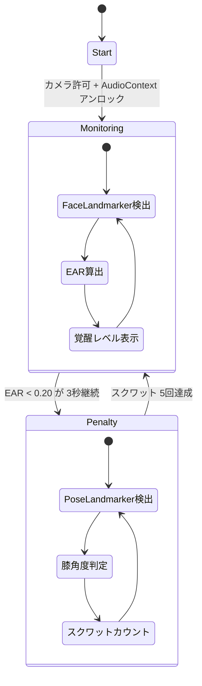
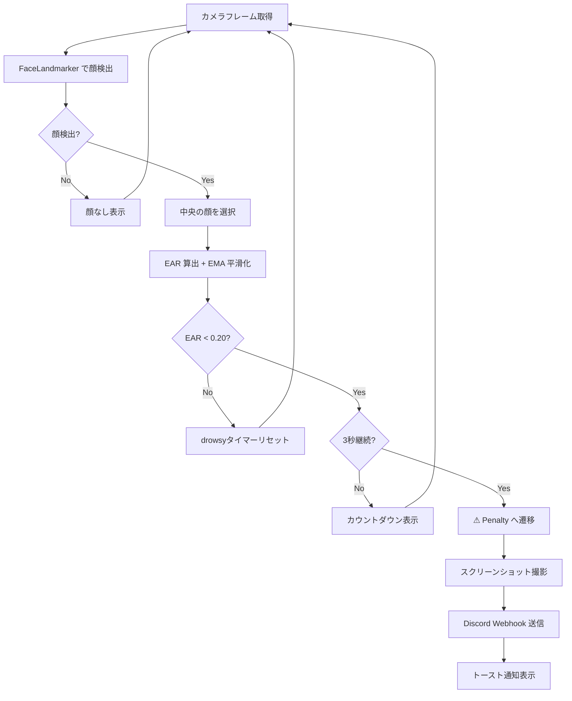
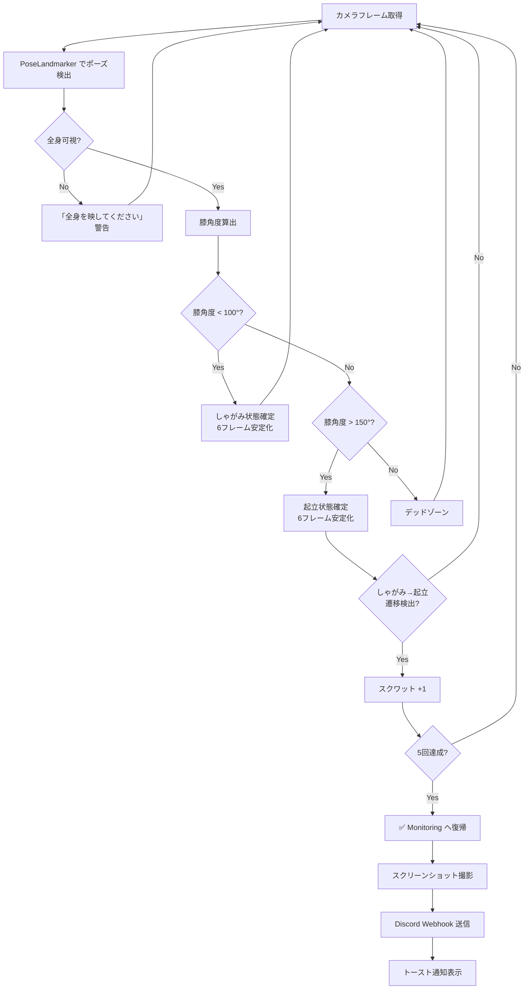
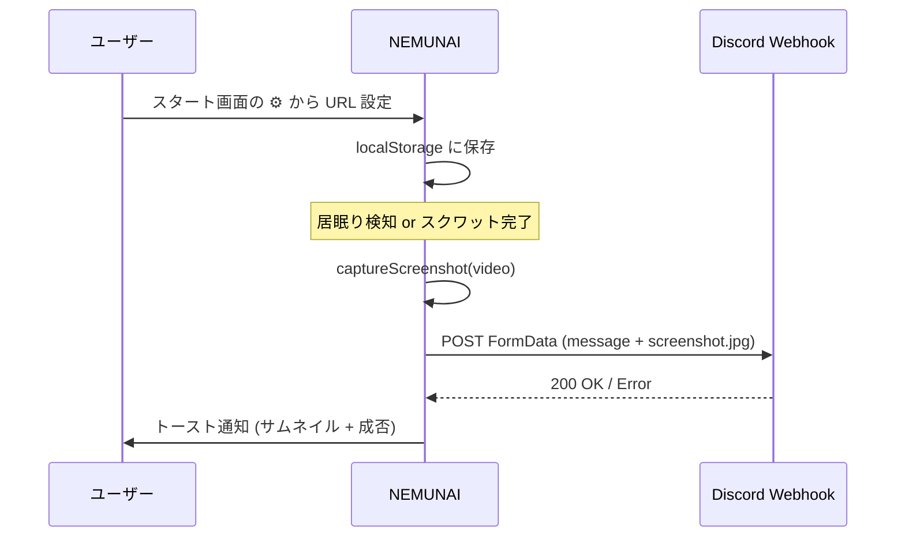
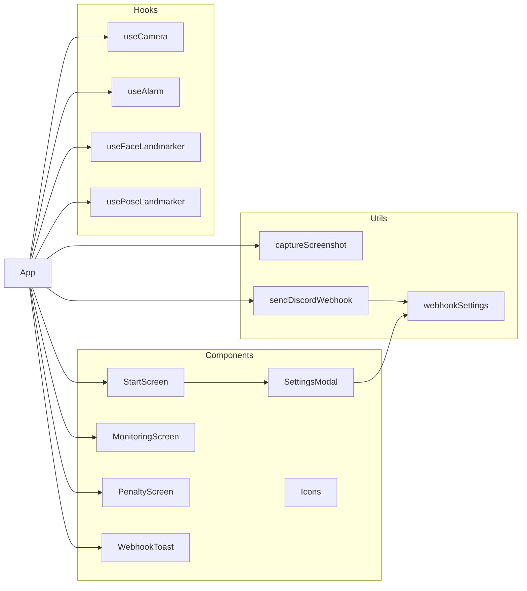

# NEMUNAI - 居眠り検知 & スクワット強制解除 Web アプリ

サーバー不要、スマホのブラウザだけで完結する居眠り検知アプリ。
居眠りを検知するとアラームが鳴り、**スクワット 5 回**で解除できる。

## 技術スタック

| カテゴリ | 技術 |
|---------|------|
| フロントエンド | React 19 + TypeScript, Vite 7 |
| スタイリング | Tailwind CSS v4 (ダークテーマ + ネオンアクセント) |
| AI 推論 | @mediapipe/tasks-vision (ブラウザ上 WASM + GPU) |
| 顔検出 | FaceLandmarker — 468 点顔メッシュ, EAR (Eye Aspect Ratio) 計算 |
| ポーズ検出 | PoseLandmarker Lite — 33 点骨格, 膝角度によるスクワット判定 |
| アラーム | Web Audio API — square 波 880Hz + 8Hz LFO 変調 |
| 通知 | Discord Webhook — スクリーンショット付き自動通知 + トースト UI |
| HTTPS | @vitejs/plugin-basic-ssl (モバイルカメラ API 対応) |

## アプリの状態遷移



## 検出フロー

### 居眠り検知 (Monitoring)



### スクワット検出 (Penalty)



## Discord 通知 (オプション)



- スタート画面の ⚙ ボタンから Discord Webhook URL を設定
- 居眠り検知時・スクワット完了時にスクリーンショット付きで自動通知
- 送信結果は右下トーストで即時フィードバック (成功=緑 / 失敗=赤)
- URL 未設定時はトースト表示なし、検知ループに影響なし
- 詳細: [docs/discord-webhook-setup.md](docs/discord-webhook-setup.md)

## セットアップ

```bash
npm install
npm run dev
```

### スマホからアクセス

カメラ API は HTTPS 必須のため、Vite は自己署名証明書付きで起動する (`@vitejs/plugin-basic-ssl`)。

```
https://<PC の IP>:5173/
```

ブラウザの「安全でない接続」警告を許可して進む。

## プロジェクト構成



```
src/
├── main.tsx                          # エントリーポイント
├── index.css                         # Tailwind CSS + アニメーション定義
├── types.ts                          # 型定義 (AppState, EARResult, SquatResult)
├── App.tsx                           # 状態管理 + 検出ループ + トースト制御
├── utils/
│   ├── webhookSettings.ts            # Webhook URL の保存・読み込み・バリデーション
│   ├── captureScreenshot.ts          # video要素からJPEGスクリーンショット取得
│   └── sendDiscordWebhook.ts         # Discord Webhook送信 (成功/失敗をbooleanで返却)
├── hooks/
│   ├── useCamera.ts                  # カメラ制御 (getUserMedia, stream管理)
│   ├── useAlarm.ts                   # Web Audio API アラーム (square波 + LFO)
│   ├── useFaceLandmarker.ts          # 顔検出 + EAR計算 + EMA平滑化 + 中央顔選択
│   └── usePoseLandmarker.ts          # ポーズ検出 + スクワット判定 + フレーム安定化
└── components/
    ├── Icons.tsx                     # SVGアイコン群
    ├── StartScreen.tsx               # 初期画面 + 設定ボタン
    ├── MonitoringScreen.tsx          # 監視画面 (覚醒レベルバー + 警告表示)
    ├── PenaltyScreen.tsx             # ペナルティ画面 (カウンター + プログレスリング)
    ├── SettingsModal.tsx             # Discord Webhook設定モーダル
    └── WebhookToast.tsx              # Webhook送信トースト通知
```

## 主要パラメータ

| パラメータ | 値 | 説明 |
|-----------|-----|------|
| `EAR_THRESHOLD_LOW` | 0.20 | この値以下で居眠り状態に入る |
| `EAR_THRESHOLD_HIGH` | 0.24 | この値以上で居眠り状態を抜ける (ヒステリシス) |
| `DROWSY_DURATION_SEC` | 3 | 居眠り継続でペナルティ発動までの秒数 |
| `REQUIRED_SQUATS` | 5 | ペナルティ解除に必要なスクワット回数 |
| `EMA_ALPHA` | 0.25 | EAR の指数移動平均フィルタ係数 |
| `SQUAT_ANGLE_ENTER` | 100° | しゃがみ判定角度 (膝) |
| `SQUAT_ANGLE_EXIT` | 150° | 起立判定角度 (膝) |
| `STABLE_FRAMES_REQUIRED` | 6 | 状態確定に必要な連続フレーム数 |
| `SQUAT_COOLDOWN_MS` | 1500ms | スクワットカウント間の最小間隔 |
